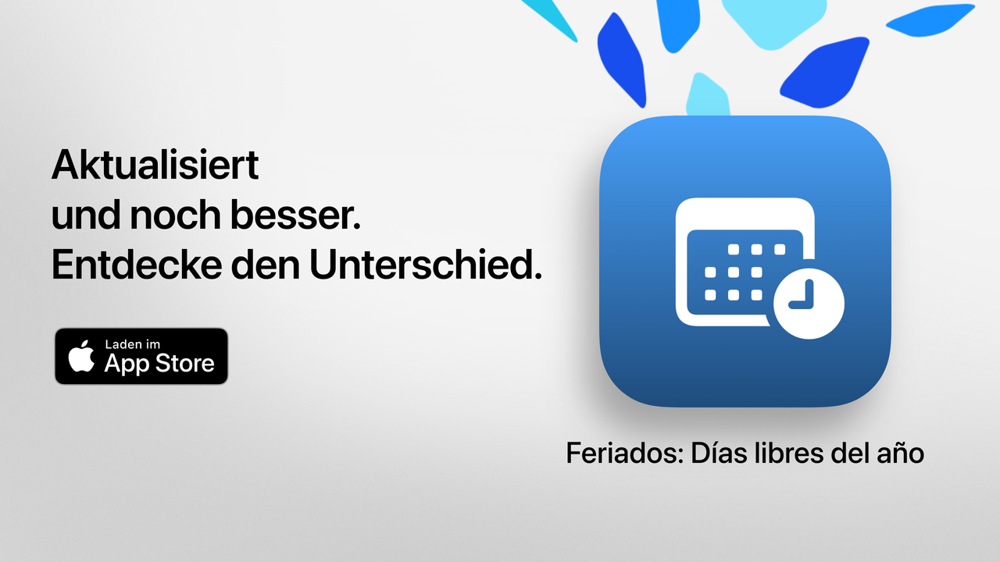

  
  
# Feiertage  
  
Feiertage: deine freie Zeit, gut genutzt.  
  
Die einfachste, klarste und leistungsstärkste Art, die Feiertage in Argentinien nachzuschlagen.  
Mit modernem Design und Funktionen für den Alltag hilft dir Feiertage, Kurztrips und Urlaube zu planen oder einfach deine Wochenenden mehr zu genießen.  
  
Prüfe in Sekundenschnelle den nächsten Feiertag, erkunde den kompletten Kalender und filtere arbeitsfreie Tage nach deinen Interessen, Überzeugungen oder deinem Lebensstil.  
  
Ideal für Studierende, Berufstätige, Familien und alle, die ihre freien Tage besser nutzen möchten.  
  
## Hauptfunktionen (kostenlos)  
  
• Countdown bis zum nächsten Feiertag  
• Vollständiger Kalender: nationale, touristische und religiöse Feiertage  
• Filter nach Typ: feste, bewegliche, touristische oder arbeitsfreie Tage  
• Suche nach Name oder Anlass des Feiertags  
• Option, vergangene Feiertage auszublenden  
• Wochenagenda, um nahe Feiertage zu sehen  
• Moderne, klare Oberfläche, die sich an alle Geräte anpasst  
  
## Erweiterte Funktionen mit Feiertage Pro  
  
• Füge Feiertage deinem persönlichen Kalender hinzu  
• Erhalte Benachrichtigungen vor jedem Feiertag  
• Filter nach Gemeinschaft (muslimisch, jüdisch, armenisch)  
• Detaillierte Statistiken und interaktive Diagramme  
• Monatliche Vergleiche von Feiertagen  
• Anzeige von langen Wochenenden  
• Erweiterte Suche nach Wochentag oder Monat  
• Detaillierte Monats- und Wochenansicht des Kalenders  
  
**Feiertage Pro** beinhaltet eine kostenlose Testphase. Kündige mindestens 24 Stunden vor Ablauf, wenn du keine Kosten möchtest.  
  
## Datenschutz und Bedingungen  
  
• [Datenschutzrichtlinie](https://lucasditomase.github.io/feriados/de/privacy-policy)  
• [Nutzungsbedingungen](https://lucasditomase.github.io/feriados/de/terms-and-conditions)  
  
## Unterstützung  
  
Wenn du Fragen oder Vorschläge hast oder der Community beitreten möchtest, kannst du gerne eine [Diskussion](https://github.com/lucasditomase/feriados/discussions) starten.  
  
---  
  
*Feiertage ist ein Privatprojekt. Danke, dass du unabhängige Entwickler unterstützt.*  
  

  
    

  
