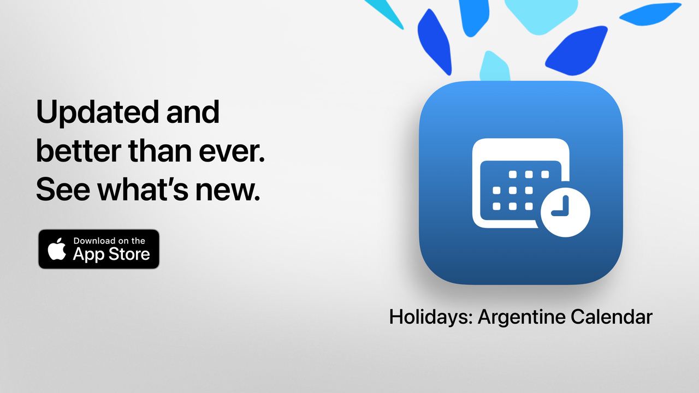

# Holidays

## 🇪🇸 [Español](https://lucasditomase.github.io/Feriados)

**Holidays** is an iOS app that lets you quickly and clearly check all national, tourism-related, and religious holidays in Argentina.

Perfect for planning long weekends, organizing vacations, or simply making better use of your time.

## Main Features (Free)

• Countdown to the next holiday  
• Full calendar: national, tourism, and religious holidays  
• Filters by type: fixed, movable, tourism-related, or non-working days  
• Search by name or reason for the holiday  
• Option to hide past holidays and focus on upcoming ones  
• Weekly agenda to view nearby holidays  
• Modern, clear interface adaptable to all devices  

## Advanced Features with Holidays Pro

• Add holidays to your personal calendar  
• Set automatic reminders  
• Filters by community (Muslim, Jewish, Armenian)  
• Detailed statistics and interactive graphs  
• Monthly holiday comparisons  
• Visualization of long weekends  
• Advanced search by weekday or month  
• Full calendar with monthly and weekly views  

**Holidays Pro** includes a free trial. To avoid charges, be sure to cancel at least 24 hours before the trial ends.

## Privacy Policy and Terms

• [Privacy Policy](https://lucasditomase.github.io/Feriados/en/privacy-policy)  
• [Terms and Conditions](https://lucasditomase.github.io/Feriados/en/terms-and-conditions)  

## Support

If you have questions, suggestions, or want to join the community, feel free to start a [discussion](https://github.com/lucasditomase/Feriados/discussions).

---

*Holidays is a personal project. Thank you for supporting independent development.*

  

