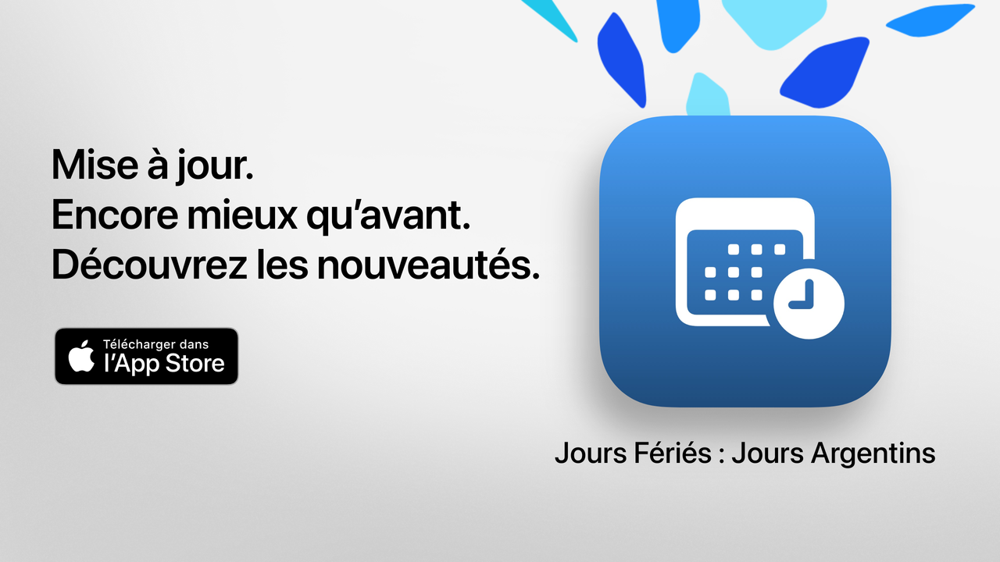

  

# Jours Fériés  

Jours Fériés : votre temps libre, bien utilisé.  

La façon la plus simple, claire et puissante de consulter les jours fériés en Argentine.  
Avec un design moderne et des fonctionnalités pensées pour le quotidien, Jours Fériés vous aide à planifier des escapades, des vacances ou simplement à mieux profiter de vos week-ends.  

Consultez en quelques secondes la date du prochain férié, explorez le calendrier complet et filtrez les jours non travaillés selon vos intérêts, croyances ou mode de vie.  

Idéal pour les étudiants, les travailleurs, les familles et toute personne souhaitant mieux profiter de ses jours libres.  

## Fonctionnalités principales (gratuites)  

• Compte à rebours jusqu'au prochain jour férié  
• Calendrier complet : fériés nationaux, touristiques et religieux  
• Filtres par type : fixes, mobiles, touristiques ou jours non travaillés  
• Recherche par nom ou motif du férié  
• Option pour masquer les fériés passés  
• Agenda hebdomadaire pour voir les fériés proches  
• Interface moderne et claire adaptée à tous les appareils  

## Fonctionnalités avancées avec Jours Fériés Pro  

• Ajoutez les fériés à votre calendrier personnel  
• Recevez des notifications avant chaque férié  
• Filtres par communauté (musulmane, juive, arménienne)  
• Statistiques détaillées et graphiques interactifs  
• Comparaisons mensuelles des fériés  
• Visualisation des ponts  
• Recherche avancée par jour de la semaine ou par mois  
• Vue mensuelle et hebdomadaire détaillée du calendrier  

**Jours Fériés Pro** comprend une période d'essai gratuite. Annulez au moins 24 heures avant la fin si vous ne souhaitez pas être facturé.  

## Politique de confidentialité et conditions  

• [Politique de confidentialité](https://lucasditomase.github.io/feriados/fr/privacy-policy)  
• [Conditions générales](https://lucasditomase.github.io/feriados/fr/terms-and-conditions)  

## Assistance  

Si vous avez des questions, des suggestions ou souhaitez rejoindre la communauté, n'hésitez pas à ouvrir une [discussion](https://github.com/lucasditomase/feriados/discussions).  

---  

*Jours Fériés est un projet personnel. Merci de soutenir les développeurs indépendants.*  

  
    

  
