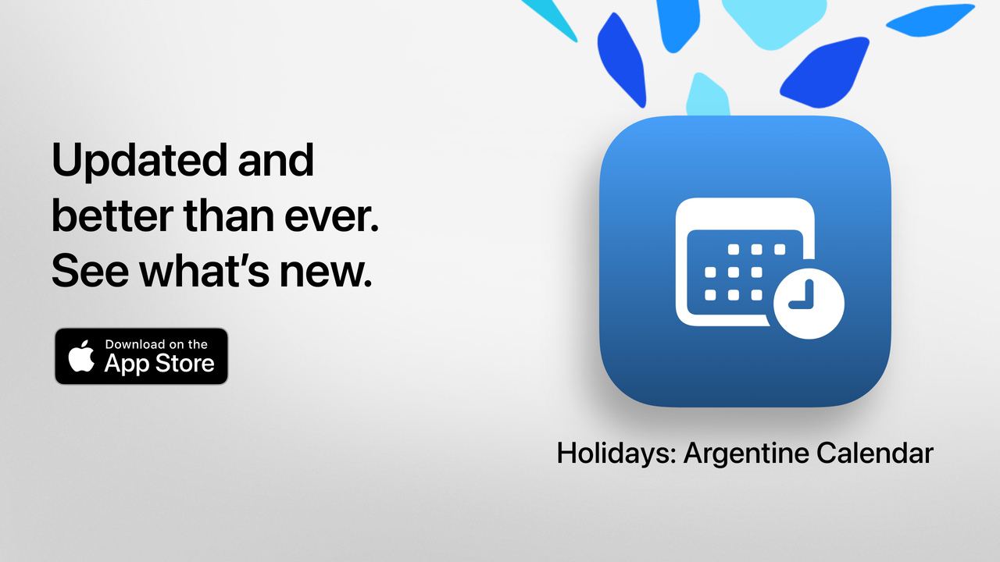

  

# छुट्टियाँ  

छुट्टियाँ: आपका खाली समय, सही ढंग से बिताया जाए।  

अर्जेंटीना के अवकाश देखने का सबसे सरल, स्पष्ट और शक्तिशाली तरीका।  
आधुनिक डिज़ाइन और रोज़मर्रा की सुविधाओं के साथ, छुट्टियाँ आपको घूमने-फिरने, छुट्टियों की योजना बनाने या बस अपने सप्ताहांत को अधिक आनंददायक बनाने में मदद करता है।  

सिर्फ कुछ ही सेकंड में अगला अवकाश कब है देखें, पूरा कैलेंडर ब्राउज़ करें और गैर‑कार्य दिवसों को अपनी रुचियों, आस्थाओं या जीवनशैली के अनुसार फ़िल्टर करें।  

यह छात्रों, कामकाजी लोगों, परिवारों और उन सभी के लिए आदर्श है जो अपने अवकाश का पूरा लाभ उठाना चाहते हैं।  

## मुख्य विशेषताएँ (नि:शुल्क)  

• अगले अवकाश की उलटी गिनती  
• पूरा कैलेंडर: राष्ट्रीय, पर्यटन और धार्मिक अवकाश  
• प्रकार के अनुसार फ़िल्टर: स्थिर, परिवर्ती, पर्यटन संबंधी या गैर‑कार्य दिवस  
• अवकाश के नाम या कारण से खोजें  
• बीते अवकाश छिपाने का विकल्प  
• आस‑पास के अवकाश देखने के लिए साप्ताहिक एजेंडा  
• सभी उपकरणों पर अनुकूलित आधुनिक और स्पष्ट इंटरफ़ेस  

## छुट्टियाँ Pro के उन्नत फ़ीचर  

• अपने निजी कैलेंडर में अवकाश जोड़ें  
• हर अवकाश से पहले सूचनाएँ प्राप्त करें  
• समुदाय के अनुसार फ़िल्टर (मुस्लिम, यहूदी, आर्मेनियाई)  
• विस्तृत आँकड़े और इंटरैक्टिव ग्राफ़  
• मासिक अवकाश तुलना  
• लंबे सप्ताहांत की दृश्यता  
• सप्ताह के दिन या महीने के अनुसार उन्नत खोज  
• मासिक और साप्ताहिक कैलेंडर का विस्तृत दृश्य  

**छुट्टियाँ Pro** में एक निःशुल्क परीक्षण अवधि शामिल है। यदि आप शुल्क नहीं देना चाहते, तो समाप्त होने से कम से कम 24 घंटे पहले रद्द कर दें।  

## गोपनीयता नीति और नियम  

• [गोपनीयता नीति](https://lucasditomase.github.io/feriados/hi/privacy-policy)  
• [नियम और शर्तें](https://lucasditomase.github.io/feriados/hi/terms-and-conditions)  

## सहायता  

यदि आपके पास प्रश्न, सुझाव हैं या आप समुदाय से जुड़ना चाहते हैं, तो निःसंकोच [चर्चा](https://github.com/lucasditomase/feriados/discussions) शुरू करें।  

---  

*छुट्टियाँ एक व्यक्तिगत प्रोजेक्ट है। स्वतंत्र विकास का समर्थन करने के लिए धन्यवाद.*  

  
    

  
