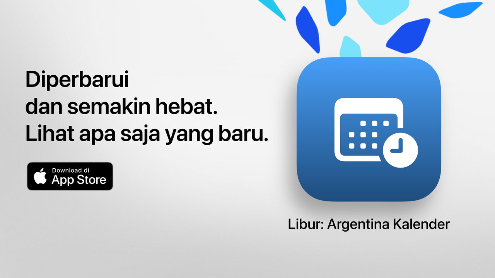

  

# Libur  

Libur: waktu luangmu dimanfaatkan dengan baik.  

Cara paling sederhana, jelas, dan kuat untuk memeriksa hari libur di Argentina.  
Dengan desain modern dan fitur sehari-hari, Libur membantumu merencanakan liburan singkat, berwisata, atau sekadar menikmati akhir pekan dengan lebih baik.  

Cek dalam hitungan detik kapan libur berikutnya, jelajahi kalender lengkap dan saring hari-hari nonkerja sesuai minat, keyakinan, atau gaya hidupmu.  

Ideal untuk pelajar, pekerja, keluarga, dan siapa pun yang ingin memaksimalkan hari liburnya.  

## Fitur Utama (Gratis)  

• Hitung mundur ke hari libur berikutnya  
• Kalender lengkap: libur nasional, wisata, dan keagamaan  
• Filter berdasarkan jenis: tetap, berpindah, terkait pariwisata, atau hari tidak bekerja  
• Pencarian berdasarkan nama atau alasan libur  
• Opsi untuk menyembunyikan libur yang sudah lewat  
• Agenda mingguan untuk melihat libur terdekat  
• Antarmuka modern dan jelas yang dapat menyesuaikan semua perangkat  

## Fitur Lanjutan dengan Libur Pro  

• Tambahkan libur ke kalender pribadimu  
• Terima pemberitahuan sebelum setiap libur  
• Filter berdasarkan komunitas (Muslim, Yahudi, Armenia)  
• Statistik terperinci dan grafik interaktif  
• Perbandingan libur bulanan  
• Visualisasi akhir pekan panjang  
• Pencarian lanjutan berdasarkan hari dalam minggu atau bulan  
• Tampilan kalender bulanan dan mingguan secara detail  

**Libur Pro** menyertakan masa uji coba gratis. Batalkan minimal 24 jam sebelumnya jika tidak ingin dikenakan biaya.  

## Kebijakan Privasi dan Ketentuan  

• [Kebijakan Privasi](https://lucasditomase.github.io/feriados/id/privacy-policy)  
• [Syarat dan Ketentuan](https://lucasditomase.github.io/feriados/id/terms-and-conditions)  

## Dukungan  

Jika kamu memiliki pertanyaan, saran, atau ingin bergabung dengan komunitas, silakan mulai [diskusi](https://github.com/lucasditomase/feriados/discussions).  

---  

*Libur adalah proyek pribadi. Terima kasih telah mendukung pengembangan independen.*  

  
    

  
