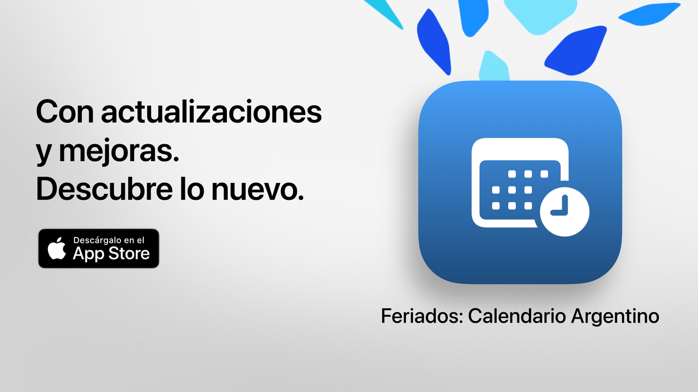

# Feriados

Feriados: tu tiempo libre, bien aprovechado.

La forma más simple, clara y poderosa de consultar los feriados en Argentina.
Con diseño moderno y funcionalidades pensadas para el día a día, Feriados te ayuda a planificar escapadas, vacaciones o simplemente a disfrutar más tus fines de semana.

Consultá en segundos cuándo es el próximo feriado, explorá el calendario completo y filtrá los días no laborables según tus intereses, creencias o estilo de vida.

Ideal para estudiantes, trabajadores, familias y cualquier persona que quiera aprovechar mejor sus días libres.

## Funciones principales (gratis)

• Cuenta regresiva al próximo feriado  
• Calendario completo: nacionales, turísticos y religiosos  
• Filtros por tipo: inamovibles, trasladables, turísticos o no laborables  
• Búsqueda por nombre o motivo del feriado  
• Opción para ocultar feriados pasados  
• Agenda semanal para ver los feriados cercanos  
• Interfaz moderna, clara y adaptable a todos los dispositivos  

## Funciones avanzadas con Feriados Pro

• Agregar feriados a tu calendario personal  
• Recibir notificaciones antes de cada feriado  
• Filtros por comunidad (musulmana, judía, armenia)  
• Estadísticas detalladas y gráficos interactivos  
• Comparativas de feriados entre meses  
• Visualización de fines de semana largos  
• Búsqueda avanzada por día de la semana o mes  
• Vista mensual y semanal detallada del calendario  

**Feriados Pro** incluye una prueba gratuita. Cancelá al menos 24 horas antes de que finalice si no querés que se te cobre.

## Política de privacidad y términos

• [Política de privacidad](https://lucasditomase.github.io/feriados/es/privacy-policy)  
• [Términos y condiciones](https://lucasditomase.github.io/feriados/es/terms-and-conditions)

## Soporte

Si tenés dudas, sugerencias o querés participar de la comunidad, podés abrir una [discusión](https://github.com/lucasditomase/feriados/discussions).

---

*Feriados es un proyecto personal. Gracias por apoyar el desarrollo independiente.*

  

