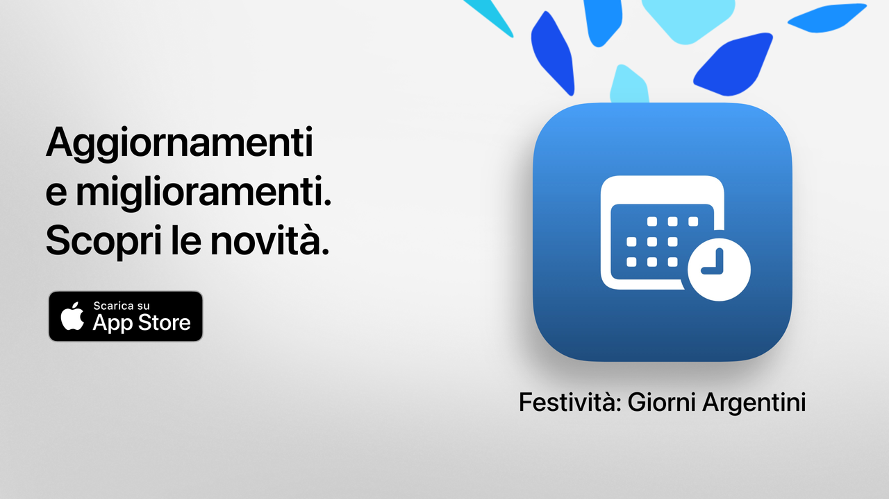

# Holidays

Holidays: il tuo tempo libero, ben sfruttato.

Il modo più semplice, chiaro e potente per consultare le festività in Argentina.
Con un design moderno e funzioni pensate per la vita di tutti i giorni, Holidays ti aiuta a programmare gite, vacanze o semplicemente a goderti di più i fine settimana.

Controlla in pochi secondi quando è la prossima festività, esplora il calendario completo e filtra i giorni non lavorativi in base ai tuoi interessi, credenze o stile di vita.

Ideale per studenti, lavoratori, famiglie e chiunque voglia sfruttare meglio i propri giorni liberi.

## Funzioni principali (gratuite)

• Conto alla rovescia per la prossima festività  
• Calendario completo: festività nazionali, turistiche e religiose  
• Filtri per tipo: fisse, mobili, turistiche o non lavorative  
• Ricerca per nome o motivo della festività  
• Opzione per nascondere le festività passate
• Agenda settimanale per vedere le festività vicine  
• Interfaccia moderna e chiara adattabile a tutti i dispositivi  

## Funzionalità avanzate con Holidays Pro

• Aggiungi le festività al tuo calendario personale  
• Ricevi notifiche prima di ogni festività
• Filtri per comunità (musulmana, ebraica, armena)  
• Statistiche dettagliate e grafici interattivi  
• Confronti mensili delle festività  
• Visualizzazione dei ponti  
• Ricerca avanzata per giorno della settimana o mese  
• Vista mensile e settimanale dettagliata del calendario

**Holidays Pro** include una prova gratuita. Annullala almeno 24 ore prima della fine se non vuoi che ti venga addebitato nulla.

## Informativa sulla privacy e termini

• [Informativa sulla privacy](https://lucasditomase.github.io/feriados/it/privacy-policy)
• [Termini e condizioni](https://lucasditomase.github.io/feriados/it/terms-and-conditions)

## Supporto

Se hai domande, suggerimenti o vuoi partecipare alla community, sentiti libero di aprire una [discussione](https://github.com/lucasditomase/feriados/discussions).

---

*Holidays è un progetto personale. Grazie per sostenere gli sviluppatori indipendenti.*

  

