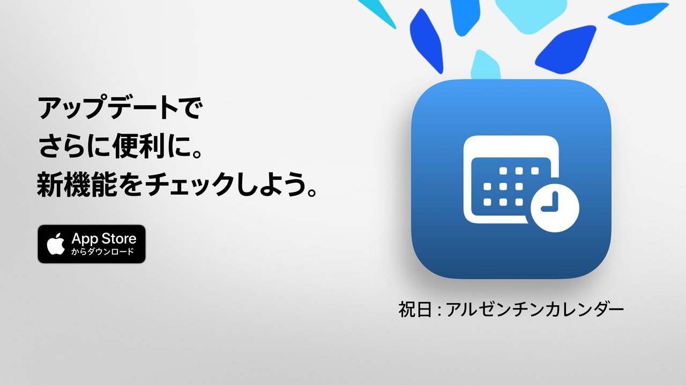

  

# 祝日  

祝日：あなたの自由時間を有意義に。  

アルゼンチンの祝日を確認する最もシンプルで分かりやすく、強力な方法です。  
モダンなデザインと日常向けの機能で、休暇や週末をより楽しむための計画をサポートします。  

次の祝日がいつか数秒で把握でき、カレンダー全体を閲覧して興味や信仰、ライフスタイルに合わせて休みを絞り込めます。  

学生、社会人、家族など、休日を最大限活用したいすべての人に最適です。  

## 主な機能（無料）  

• 次の祝日までのカウントダウン  
• 祝日一覧：国民の祝日、観光関連、宗教関連  
• 種類別フィルター：固定日、移動日、観光目的、その他の休業日  
• 祝日の名称や理由で検索  
• 過ぎた祝日を非表示にするオプション  
• 近くの祝日を確認できる週間アジェンダ  
• すべてのデバイスに対応したモダンで見やすいインターフェース  

## 祝日 Pro の高度な機能  

• 個人カレンダーに祝日を追加  
• 各祝日の前に通知を受け取る  
• コミュニティ別フィルター（ムスリム、ユダヤ、アルメニア）  
• 詳細な統計とインタラクティブなグラフ  
• 月ごとの祝日比較  
• 連休の可視化  
• 曜日や月での高度な検索  
• 月間および週間の詳細カレンダー表示  

**祝日 Pro** には無料トライアルが含まれています。料金を発生させたくない場合は、終了の少なくとも24時間前までにキャンセルしてください。  

## プライバシーポリシーと利用規約  

• [プライバシーポリシー](https://lucasditomase.github.io/feriados/ja/privacy-policy)  
• [利用規約](https://lucasditomase.github.io/feriados/ja/terms-and-conditions)  

## サポート  

質問や提案、コミュニティへの参加をご希望の場合は、遠慮なく [ディスカッション](https://github.com/lucasditomase/feriados/discussions) を開始してください。  

---  

*祝日は個人プロジェクトです。独立した開発を応援していただきありがとうございます。*  

  
    

  
