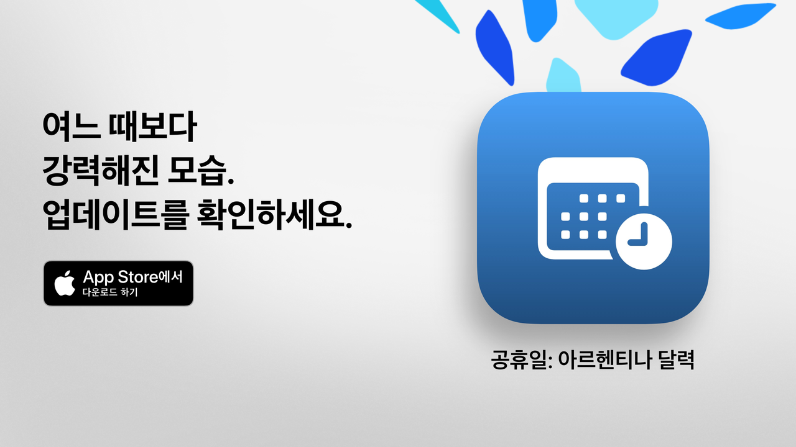

  
  
# 공휴일  
  
공휴일: 소중한 자유 시간을 알차게.  
  
아르헨티나의 공휴일을 확인하는 가장 간단하고 명확하며 강력한 방법입니다.  
현대적인 디자인과 일상에 유용한 기능을 갖춘 공휴일 앱은 짧은 여행이나 휴가 계획은 물론 주말을 더욱 즐겁게 보낼 수 있도록 도와줍니다.  
  
다음 공휴일이 언제인지 몇 초 만에 확인하고 전체 달력을 탐색하며 관심사나 신념, 생활 방식에 따라 휴일을 필터링할 수 있습니다.  
  
학생, 직장인, 가족 등 휴일을 최대한 활용하고 싶은 모든 분께 안성맞춤입니다.  
  
## 주요 기능(무료)  
  
• 다음 공휴일까지 남은 일수 표시  
• 국가 공휴일, 관광 휴일, 종교 휴일을 모두 포함한 전체 달력  
• 유형별 필터: 고정일, 이동일, 관광, 비근무일  
• 휴일 이름이나 이유로 검색  
• 이미 지난 휴일 숨기기 옵션  
• 가까운 휴일을 확인할 수 있는 주간 일정  
• 모든 기기에 잘 어울리는 현대적이고 깔끔한 인터페이스  
  
## 공휴일 Pro의 고급 기능  
  
• 개인 일정표에 휴일 추가  
• 각 휴일 전에 알림 받기  
• 공동체별 필터 (이슬람, 유대교, 아르메니아)  
• 자세한 통계와 인터랙티브 그래프  
• 월별 휴일 비교  
• 연휴 시각화  
• 요일 또는 월별 고급 검색  
• 월간 및 주간 달력을 자세히 보기  
  
**공휴일 Pro**는 무료 체험을 제공합니다. 비용이 청구되지 않으려면 종료 24시간 이전에 취소하세요.  
  
## 개인정보 처리방침 및 이용약관  
  
• [Privacy Policy](https://lucasditomase.github.io/feriados/ko/privacy-policy)  
• [Terms and Conditions](https://lucasditomase.github.io/feriados/ko/terms-and-conditions)  
  
## 지원  
  
질문이나 제안이 있거나 커뮤니티에 참여하고 싶다면 [discussion](https://github.com/lucasditomase/feriados/discussions)에서 자유롭게 의견을 남겨주세요.  
  
---  
  
*공휴일은 개인 프로젝트입니다. 독립 개발을 응원해 주셔서 감사합니다.*  
  

  
    

  
