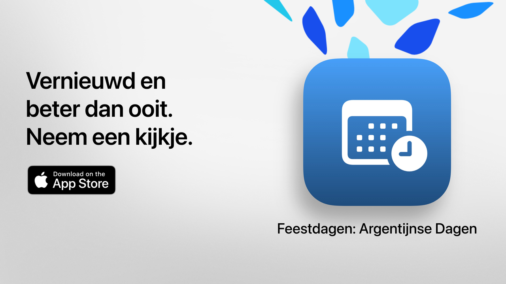

  
  
# Feestdagen  
  
Feestdagen: je vrije tijd, optimaal benut.

De eenvoudigste, duidelijkste en krachtigste manier om de feestdagen van Argentinië te raadplegen.
Met een modern ontwerp en functies voor alledag helpt Feestdagen je uitstapjes, vakanties of gewoon je weekenden beter te plannen.

Bekijk binnen enkele seconden wanneer de volgende feestdag is, verken de volledige kalender en filter de niet‑werkdagen op basis van je interesses, overtuigingen of levensstijl.

Ideaal voor studenten, werknemers, gezinnen en iedereen die het meeste uit zijn vrije dagen wil halen.
  
## Belangrijkste functies (gratis)

• Aftellen tot de volgende feestdag
• Volledige kalender: nationale, toeristische en religieuze feestdagen
• Filters op type: vast, verplaatsbaar, toeristisch of niet‑werkdagen
• Zoeken op naam of reden van de feestdag
• Mogelijkheid om voorbije feestdagen te verbergen
• Wekelijkse agenda met nabije feestdagen
• Moderne, duidelijke interface die zich aan alle apparaten aanpast
  
## Geavanceerde functies met Feestdagen Pro

• Voeg feestdagen toe aan je persoonlijke agenda
• Ontvang meldingen vóór elke feestdag
• Filters per gemeenschap (moslim, joods, Armeens)
• Gedetailleerde statistieken en interactieve grafieken
• Maandelijkse vergelijkingen van feestdagen
• Visualisatie van lange weekenden
• Geavanceerd zoeken op weekdag of maand
• Gedetailleerde maand- en weekweergave van de kalender
  
**Feestdagen Pro** bevat een gratis proefperiode. Annuleer minstens 24 uur van tevoren als je geen kosten wilt maken.
  
## Privacybeleid en voorwaarden
  
• [Privacybeleid](https://lucasditomase.github.io/feriados/nl/privacy-policy)
• [Algemene voorwaarden](https://lucasditomase.github.io/feriados/nl/terms-and-conditions)
  
## Ondersteuning
  
Heb je vragen, suggesties of wil je deelnemen aan de community? Start gerust een [discussie](https://github.com/lucasditomase/feriados/discussions).
  
---  
  
*Feestdagen is een persoonlijk project. Bedankt voor het steunen van onafhankelijke ontwikkeling.*
  

  
    

  
