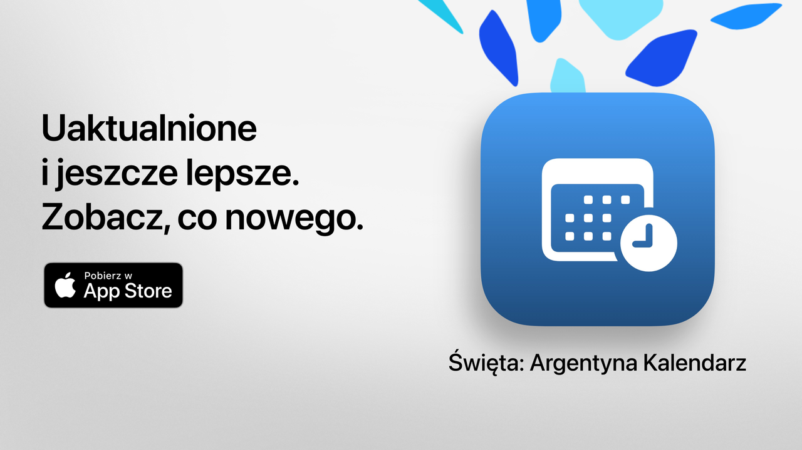

  
  
# Święta  
  
Święta: twój wolny czas dobrze wykorzystany.  
  
Najprostszy, najczytelniejszy i najpotężniejszy sposób, aby sprawdzić święta w Argentynie.  
Dzięki nowoczesnemu designowi i funkcjom na co dzień Święta pomaga planować wyjazdy,  
wakacje lub po prostu cieszyć się weekendami.  
  
Sprawdź w kilka sekund, kiedy wypada następne święto, przeglądaj pełny kalendarz i filtruj dni wolne  
zgodnie ze swoimi zainteresowaniami, wierzeniami lub stylem życia.  
  
Idealna dla studentów, pracowników, rodzin i wszystkich, którzy chcą w pełni wykorzystać dni wolne.  
  
## Główne funkcje (darmowe)  
  
• Odliczanie do następnego święta  
• Pełny kalendarz: święta państwowe, turystyczne i religijne  
• Filtry według rodzaju: stałe, ruchome, turystyczne lub dni wolne od pracy  
• Wyszukiwanie po nazwie lub powodzie święta  
• Opcja ukrywania minionych świąt  
• Tygodniowa agenda z nadchodzącymi świętami  
• Nowoczesny, przejrzysty interfejs dostosowany do wszystkich urządzeń  
  
## Zaawansowane funkcje w Święta Pro  
  
• Dodawanie świąt do osobistego kalendarza  
• Otrzymywanie powiadomień przed każdym świętem  
• Filtry według społeczności (muzułmańskiej, żydowskiej, ormiańskiej)  
• Szczegółowe statystyki i interaktywne wykresy  
• Porównania świąt między miesiącami  
• Wizualizacja długich weekendów  
• Zaawansowane wyszukiwanie według dnia tygodnia lub miesiąca  
• Szczegółowy widok kalendarza miesięcznego i tygodniowego  
  
**Święta Pro** oferuje bezpłatny okres próbny. Anuluj co najmniej 24 godziny przed jego zakończeniem,  
jeśli nie chcesz ponosić opłat.  
  
## Polityka prywatności i regulamin  
  
• [Polityka prywatności](https://lucasditomase.github.io/feriados/pl/privacy-policy)  
• [Regulamin](https://lucasditomase.github.io/feriados/pl/terms-and-conditions)  
  
## Wsparcie  
  
Jeśli masz pytania, sugestie lub chcesz dołączyć do społeczności, rozpocznij  
[dyskusję](https://github.com/lucasditomase/feriados/discussions).  
  
---  
  
*Święta to projekt osobisty. Dziękuję za wspieranie niezależnego rozwoju.*  
  

  
    

  
