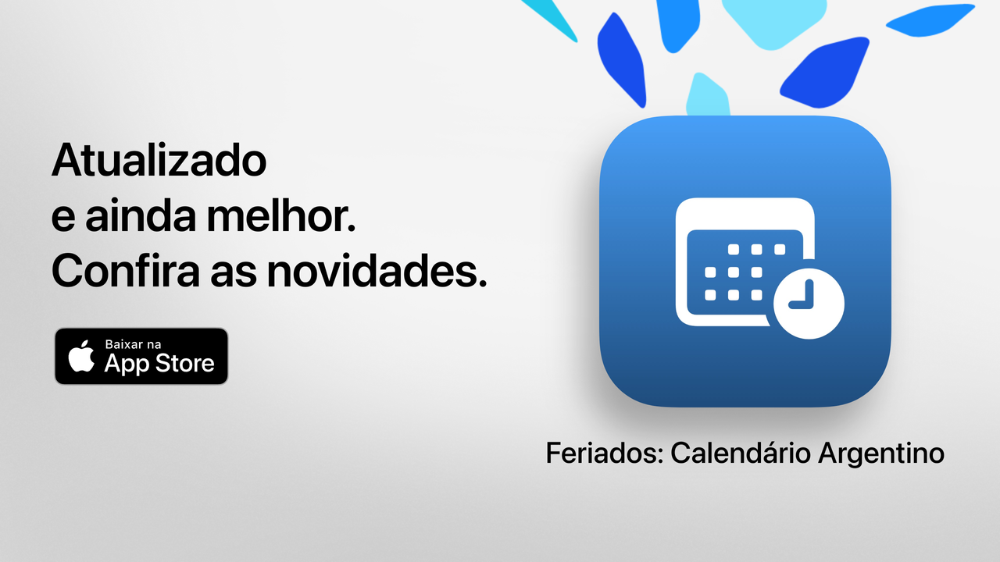

# Holidays

**Holidays** é um aplicativo para iOS que permite consultar de forma rápida e clara todos os feriados nacionais, turísticos e religiosos da Argentina.

Perfeito para planejar feriados prolongados, organizar férias ou simplesmente aproveitar melhor seu tempo.

## Principais recursos (grátis)

• Contagem regressiva para o próximo feriado  
• Calendário completo: feriados nacionais, turísticos e religiosos  
• Filtros por tipo: fixos, móveis, turísticos ou não laborais  
• Busca por nome ou motivo do feriado  
• Opção para ocultar feriados passados e focar nos próximos  
• Agenda semanal para ver os feriados próximos  
• Interface moderna e clara adaptável a todos os dispositivos  

## Recursos avançados com Holidays Pro

• Adicione feriados ao seu calendário pessoal  
• Defina lembretes automáticos  
• Filtros por comunidade (muçulmana, judaica, armênia)  
• Estatísticas detalhadas e gráficos interativos  
• Comparativos mensais de feriados  
• Visualização de feriados prolongados  
• Busca avançada por dia da semana ou mês  
• Calendário completo com vistas mensal e semanal  

**Holidays Pro** inclui um período de teste gratuito. Para evitar cobranças, cancele pelo menos 24 horas antes do fim do período.

## Política de privacidade e termos

• [Política de privacidade](https://lucasditomase.github.io/feriados/pt/politica-de-privacidade)  
• [Termos e condições](https://lucasditomase.github.io/feriados/pt/termos-e-condicoes)  

## Suporte

Se você tiver dúvidas, sugestões ou quiser participar da comunidade, fique à vontade para abrir uma [discussão](https://github.com/lucasditomase/feriados/discussions).

---

*Holidays é um projeto pessoal. Obrigado por apoiar desenvolvedores independentes.*

  

