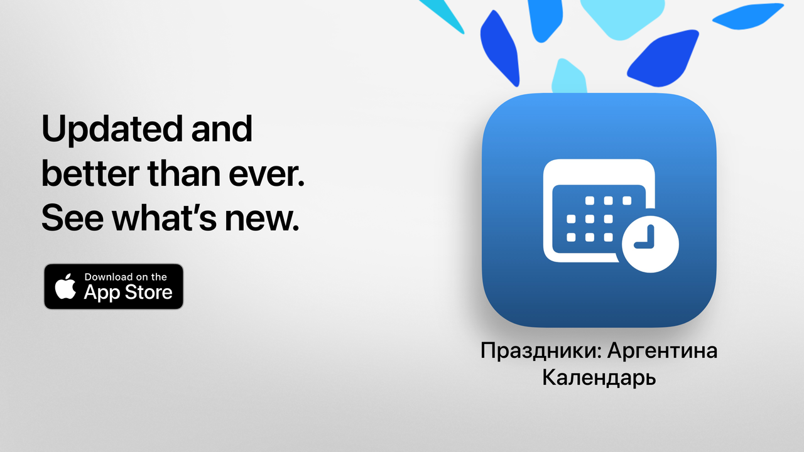

# Праздники

Праздники: ваше свободное время на пользу.

Это самый простой, понятный и мощный способ узнать праздники Аргентины. Благодаря современному дизайну и функциям на каждый день «Праздники» помогает планировать поездки, отпуска или просто лучше проводить выходные.

Узнайте за секунды, когда следующий праздничный день, просмотрите полный календарь и отфильтруйте нерабочие дни в соответствии с вашими интересами, убеждениями или стилем жизни.

Идеально для студентов, работников, семей и всех, кто хочет максимально использовать свои выходные.

## Основные возможности (бесплатно)

• Обратный отсчёт до следующего праздника
• Полный календарь: национальные, туристические и религиозные праздники
• Фильтры по типу: фиксированные, переносимые, туристические или нерабочие дни
• Поиск по названию или причине праздника
• Возможность скрывать прошедшие праздники
• Недельная повестка для просмотра ближайших праздников
• Современный, понятный интерфейс, адаптируемый под любые устройства

## Расширенные функции с Праздники Pro

• Добавление праздников в личный календарь
• Уведомления перед каждым праздником
• Фильтры по общине (мусульманской, еврейской, армянской)
• Подробная статистика и интерактивные графики
• Сравнение праздников по месяцам
• Отображение длинных выходных
• Расширенный поиск по дню недели или месяцу
• Детальный помесячный и понедельный просмотр календаря

**Праздники Pro** включает бесплатный пробный период. Отмените подписку не позднее чем за 24 часа до его окончания, если не хотите получать начисления.

## Политика конфиденциальности и условия

• [Политика конфиденциальности](https://lucasditomase.github.io/feriados/ru/privacy-policy)
• [Условия и положения](https://lucasditomase.github.io/feriados/ru/terms-and-conditions)

## Поддержка

Если у вас есть вопросы, предложения или вы хотите присоединиться к сообществу, смело [создавайте обсуждение](https://github.com/lucasditomase/feriados/discussions).

---

*«Праздники» — личный проект. Спасибо за поддержку независимой разработки.*

  

