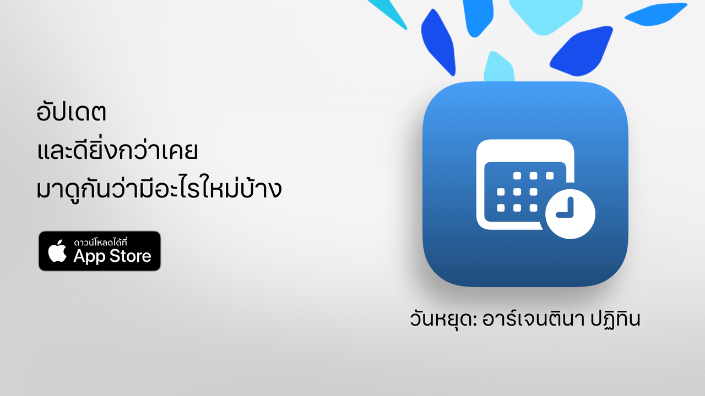

  

# วันหยุด  

วันหยุด: ใช้เวลาว่างของคุณให้คุ้มค่า  

วิธีที่ง่าย ชัดเจน และทรงพลังที่สุดในการตรวจสอบวันหยุดของอาร์เจนตินา  
ด้วยการออกแบบสมัยใหม่และฟังก์ชันสำหรับการใช้งานประจำวัน วันหยุด ช่วยคุณวางแผนทริปสั้นๆ วันหยุดยาว หรือเพียงแค่สนุกกับสุดสัปดาห์ได้มากขึ้น  

ตรวจสอบได้ภายในไม่กี่วินาทีว่าวันหยุดถัดไปคือเมื่อใด สำรวจปฏิทินฉบับเต็มและกรองวันหยุดตามความสนใจ ความเชื่อ หรือไลฟ์สไตล์ของคุณ  

เหมาะสำหรับนักเรียน คนทำงาน ครอบครัว และทุกคนที่ต้องการใช้วันหยุดให้คุ้มค่าที่สุด  

## คุณสมบัติหลัก (ฟรี)  

• นับถอยหลังสู่วันหยุดถัดไป  
• ปฏิทินครบถ้วน: วันหยุดประจำชาติ ท่องเที่ยว และศาสนา  
• กรองตามประเภท: วันหยุดคงที่ เลื่อนย้ายได้ เกี่ยวกับการท่องเที่ยว หรือวันหยุดราชการ  
• ค้นหาตามชื่อหรือเหตุผลของวันหยุด  
• ตัวเลือกซ่อนวันหยุดที่ผ่านมาแล้ว  
• ตารางประจำสัปดาห์เพื่อดูวันหยุดที่ใกล้จะมาถึง  
• อินเทอร์เฟซทันสมัยและชัดเจน ใช้ได้กับทุกอุปกรณ์  

## ฟีเจอร์ขั้นสูงกับ วันหยุด Pro  

• เพิ่มวันหยุดในปฏิทินส่วนตัวของคุณ  
• รับการแจ้งเตือนก่อนถึงวันหยุด  
• กรองตามชุมชน (มุสลิม ยิว อาร์เมเนีย)  
• สถิติละเอียดและกราฟเชิงโต้ตอบ  
• เปรียบเทียบวันหยุดรายเดือน  
• แสดงวันหยุดยาว  
• ค้นหาขั้นสูงตามวันในสัปดาห์หรือเดือน  
• มุมมองปฏิทินรายเดือนและรายสัปดาห์แบบละเอียด  

**วันหยุด Pro** มีช่วงทดลองใช้ฟรี โปรดยกเลิกอย่างน้อย 24 ชั่วโมงก่อนหมดช่วงทดลองหากไม่ต้องการถูกเรียกเก็บเงิน  

## นโยบายความเป็นส่วนตัวและข้อกำหนด  

• [นโยบายความเป็นส่วนตัว](https://lucasditomase.github.io/feriados/th/privacy-policy)  
• [ข้อกำหนดและเงื่อนไข](https://lucasditomase.github.io/feriados/th/terms-and-conditions)  

## การสนับสนุน  

หากคุณมีคำถาม ข้อเสนอแนะ หรืออยากเข้าร่วมชุมชน สามารถเริ่มต้น [การสนทนา](https://github.com/lucasditomase/feriados/discussions) ได้เลย  

---  

*วันหยุด เป็นโปรเจกต์ส่วนตัว ขอบคุณที่สนับสนุนนักพัฒนาอิสระ*  

  
    

  
