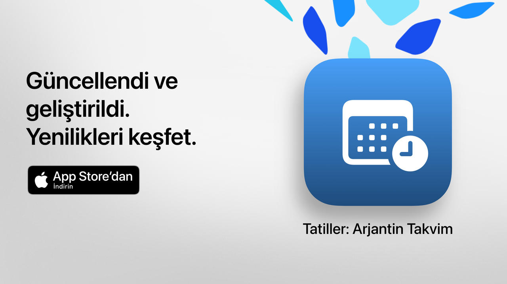

  

# Tatiller  

Tatiller: boş zamanınız, iyi değerlendirilmiş.  

Arjantin tatillerini kontrol etmenin en basit, en anlaşılır ve en güçlü yolu.  
Modern tasarımı ve günlük özellikleriyle Tatiller, kaçamaklar planlamanıza,  
tatillerinizi veya hafta sonlarınızı daha iyi değerlendirmenize yardımcı olur.  

Bir sonraki tatilin ne zaman olduğunu saniyeler içinde öğrenin, tam takvimi  
keşfedin ve çalışılmayan günleri ilgi alanlarınıza, inançlarınıza veya yaşam  
tarzınıza göre filtreleyin.  

Öğrenciler, çalışanlar, aileler ve izin günlerinden en iyi şekilde yararlanmak  
isteyen herkes için idealdir.  

## Ana Özellikler (Ücretsiz)  

• Sonraki tatil için geri sayım  
• Tam takvim: ulusal, turistik ve dini tatiller  
• Tipe göre filtreler: sabit, taşınabilir, turistik veya çalışılmayan günler  
• Tatilin adı veya nedeniyle arama  
• Geçmiş tatilleri gizleme seçeneği  
• Yakındaki tatilleri görmek için haftalık ajanda  
• Tüm cihazlara uyarlanabilen modern ve sade arayüz  

## Tatiller Pro ile Gelişmiş Özellikler  

• Tatilleri kişisel takviminize ekleyin  
• Her tatilden önce bildirim alın  
• Topluluğa göre filtreler (Müslüman, Yahudi, Ermeni)  
• Ayrıntılı istatistikler ve etkileşimli grafikler  
• Aylık tatil karşılaştırmaları  
• Uzun hafta sonlarının görselleştirilmesi  
• Haftanın günü veya aya göre gelişmiş arama  
• Ayrıntılı aylık ve haftalık takvim görünümü  

**Tatiller Pro** ücretsiz bir deneme süresi içerir. Ücretlendirilmek  
istemiyorsanız deneme bitmeden en az 24 saat önce iptal edin.  

## Gizlilik Politikası ve Koşullar  

• [Gizlilik Politikası](https://lucasditomase.github.io/feriados/tr/privacy-policy)  
• [Hüküm ve Koşullar](https://lucasditomase.github.io/feriados/tr/terms-and-conditions)  

## Destek  

Sorularınız, önerileriniz varsa ya da topluluğa katılmak istiyorsanız, bir  
[tartışma](https://github.com/lucasditomase/feriados/discussions) başlatmaktan  
çekinmeyin.  

---  

*Tatiller kişisel bir projedir. Bağımsız geliştirmeyi desteklediğiniz için  
teşekkürler.*  

  
    

  
