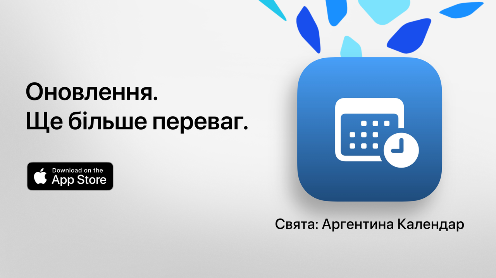

  

# Свята  

Свята: ваш вільний час, проведений з користю.  

Найпростіший, найзрозуміліший і найпотужніший спосіб переглядати свята Аргентини.  
З сучасним дизайном та щоденними функціями Свята допомагає планувати поїздки, відпустки чи просто більше насолоджуватися вихідними.  

Дізнавайтесь за кілька секунд, коли буде наступне свято, переглядайте повний календар та фільтруйте неробочі дні відповідно до ваших інтересів, переконань чи стилю життя.  

Ідеально підходить для студентів, працівників, сімей та всіх, хто хоче максимально використовувати вихідні.  

## Основні можливості (безкоштовно)  

• Зворотний відлік до наступного свята  
• Повний календар: національні, туристичні та релігійні свята  
• Фільтри за типом: фіксовані, перехідні, туристичні або неробочі дні  
• Пошук за назвою або причиною свята  
• Можливість приховувати минулі свята  
• Щотижневий огляд для перегляду найближчих свят  
• Сучасний, зрозумілий інтерфейс, що адаптується до будь-яких пристроїв  

## Розширені можливості зі Свята Pro  

• Додавання свят до особистого календаря  
• Отримання сповіщень перед кожним святом  
• Фільтри за спільнотою (мусульманською, єврейською, вірменською)  
• Детальна статистика та інтерактивні графіки  
• Місячні порівняння свят  
• Відображення довгих вихідних  
• Розширений пошук за днем тижня або місяцем  
• Детальний перегляд календаря по місяцях і тижнях  

**Свята Pro** містить безкоштовний пробний період. Скасуйте принаймні за 24 години до його завершення, якщо не хочете, щоб з вас стягнули оплату.  

## Політика конфіденційності та умови  

• [Політика конфіденційності](https://lucasditomase.github.io/feriados/uk/privacy-policy)  
• [Умови використання](https://lucasditomase.github.io/feriados/uk/terms-and-conditions)  

## Підтримка  

Якщо у вас є запитання, пропозиції або ви хочете приєднатися до спільноти, сміливо починайте [обговорення](https://github.com/lucasditomase/feriados/discussions).  

---  

*Свята — це особистий проєкт. Дякую за підтримку незалежної розробки.*  

  
    

  
