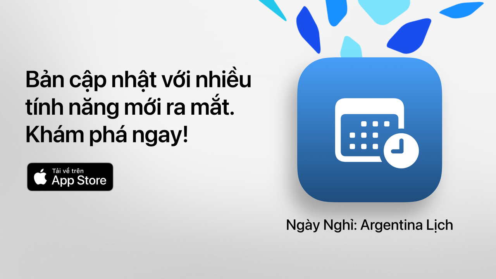

# Ngày Nghỉ

Ngày Nghỉ: thời gian rảnh của bạn, được tận hưởng trọn vẹn.

Cách đơn giản, rõ ràng và mạnh mẽ nhất để xem các ngày nghỉ lễ của Argentina.
Với thiết kế hiện đại và các tính năng phục vụ hằng ngày, Ngày Nghỉ giúp bạn lên kế hoạch cho những chuyến đi, kỳ nghỉ hay chỉ đơn giản là tận hưởng cuối tuần nhiều hơn.

Kiểm tra trong vài giây khi nào có ngày nghỉ tiếp theo, khám phá toàn bộ lịch và lọc
các ngày không làm việc theo sở thích, đức tin hay phong cách sống của bạn.

Lý tưởng cho học sinh, người đi làm, gia đình và bất kỳ ai muốn tận dụng tối đa thời gian nghỉ.

## Tính năng chính (Miễn phí)

• Đếm ngược đến ngày nghỉ tiếp theo
• Lịch đầy đủ: các ngày nghỉ quốc gia, du lịch và tôn giáo
• Bộ lọc theo loại: cố định, di dời, du lịch hoặc không làm việc
• Tìm kiếm theo tên hoặc lý do của ngày nghỉ
• Tùy chọn ẩn các ngày nghỉ đã qua
• Lịch biểu tuần để xem các ngày nghỉ gần kề
• Giao diện hiện đại, rõ ràng và thích ứng với mọi thiết bị

## Tính năng nâng cao với Ngày Nghỉ Pro

• Thêm ngày nghỉ vào lịch cá nhân của bạn
• Nhận thông báo trước mỗi ngày nghỉ
• Bộ lọc theo cộng đồng (Hồi giáo, Do Thái, Armenia)
• Thống kê chi tiết và biểu đồ tương tác
• So sánh ngày nghỉ theo tháng
• Hiển thị các kỳ nghỉ dài ngày
• Tìm kiếm nâng cao theo thứ hoặc tháng
• Xem lịch tháng và tuần chi tiết

**Ngày Nghỉ Pro** bao gồm thời gian dùng thử miễn phí. Hãy hủy ít nhất 24 giờ trước khi kết thúc nếu bạn không muốn bị tính phí.

## Chính sách quyền riêng tư và Điều khoản

• [Chính sách quyền riêng tư](https://lucasditomase.github.io/feriados/vi/privacy-policy)
• [Điều khoản và điều kiện](https://lucasditomase.github.io/feriados/vi/terms-and-conditions)

## Hỗ trợ

Nếu bạn có câu hỏi, đề xuất hoặc muốn tham gia cộng đồng, hãy thoải mái bắt đầu một [thảo luận](https://github.com/lucasditomase/feriados/discussions).

---

*Ngày Nghỉ là dự án cá nhân. Cảm ơn bạn đã ủng hộ sự phát triển độc lập.*

  

