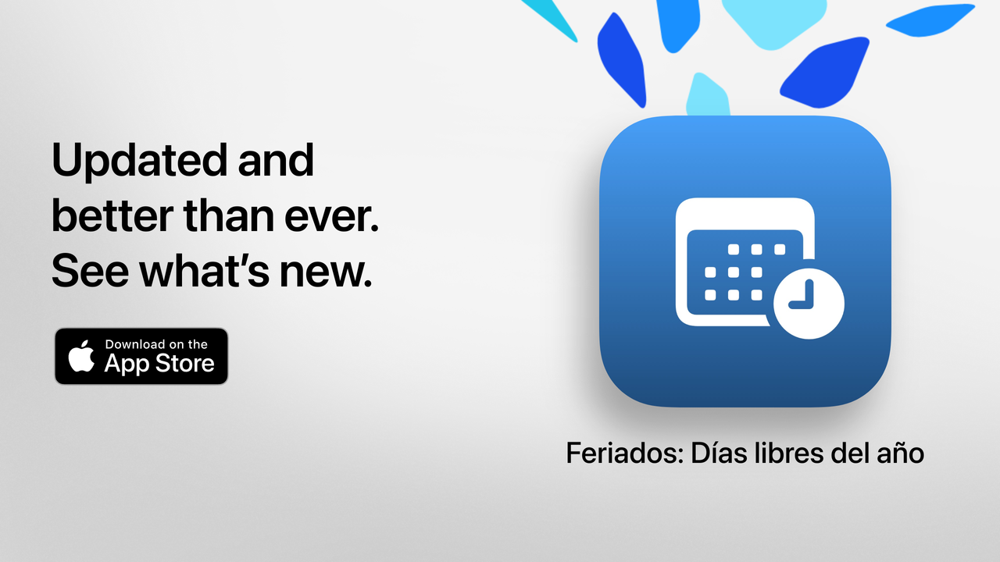

# 节假日

节假日：让你的空闲时间更有价值。

这是一款最简单、最清晰且功能强大的阿根廷节假日查询工具。
凭借现代化的设计和日常功能，节假日帮助你规划周末出游、假期或更好地享受周末。

几秒钟内即可查看下一个节日，探索完整日历，并根据兴趣、信仰或生活方式筛选非工作日。

适合学生、上班族、家庭以及任何想充分利用休息日的人。

## 主要功能（免费）

• 下一个节日倒计时
• 完整日历：国家、旅游和宗教节日
• 按类型筛选：固定、可移动、旅游相关或非工作日
• 按节日名称或原因搜索
• 可隐藏已过去的节日
• 每周议程查看临近节日
• 现代、清晰的界面，适配所有设备

## 节假日 Pro 高级功能

• 将节日添加到个人日历
• 在每个节日前收到提醒
• 按社区筛选（穆斯林、犹太、亚美尼亚）
• 详细统计和交互式图表
• 月度节日对比
• 长周末可视化
• 按星期或月份高级搜索
• 详细的月视图和周视图

**节假日 Pro** 包含免费试用。如不希望被收费，请至少在试用结束前24小时取消。

## 隐私政策与条款

• [隐私政策](https://lucasditomase.github.io/feriados/zh-Hans/privacy-policy)
• [服务条款](https://lucasditomase.github.io/feriados/zh-Hans/terms-and-conditions)

## 支持

如果你有问题、建议或想加入社区，欢迎在[讨论区](https://github.com/lucasditomase/feriados/discussions)留言。

---

*节假日是一个个人项目。感谢你对独立开发的支持。*

  

