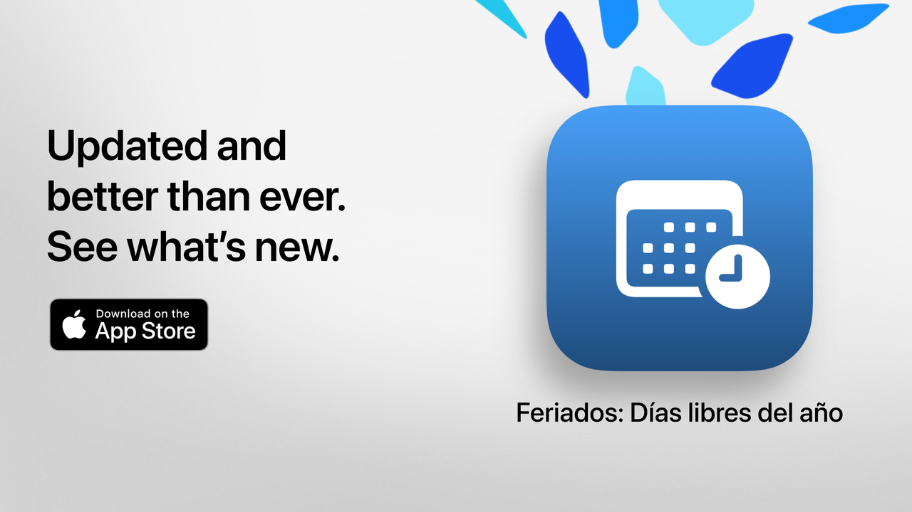

  
  
# 假期  
  
假期: your free time, well spent.  
  
The simplest, clearest and most powerful way to check Argentina's holidays.  
With a modern design and day-to-day features, 假期 helps you plan getaways, vacations or simply enjoy your weekends more.  
  
Check in seconds when the next holiday is, explore the full calendar and filter non-working days according to your interests, beliefs or lifestyle.  
  
Ideal for students, workers, families and anyone who wants to make the most of their days off.  
  
## Main Features (Free)  
  
• Countdown to the next holiday  
• Full calendar: national, tourism, and religious holidays  
• Filters by type: fixed, movable, tourism-related, or non-working days  
• Search by name or reason for the holiday  
• Option to hide past holidays  
• Weekly agenda to view nearby holidays  
• Modern, clear interface adaptable to all devices  
  
## Advanced Features with 假期 Pro  
  
• Add holidays to your personal calendar  
• Receive notifications before each holiday  
• Filters by community (Muslim, Jewish, Armenian)  
• Detailed statistics and interactive graphs  
• Monthly holiday comparisons  
• Visualization of long weekends  
• Advanced search by weekday or month  
• Detailed monthly and weekly calendar view  
  
**假期 Pro** includes a free trial. Cancel at least 24 hours before it ends if you don't want to be charged.  
  
## Privacy Policy and Terms  
  
• [Privacy Policy](https://lucasditomase.github.io/feriados/zh-Hant/privacy-policy)  
• [Terms and Conditions](https://lucasditomase.github.io/feriados/zh-Hant/terms-and-conditions)  
  
## Support  
  
If you have questions, suggestions, or want to join the community, feel free to start a [discussion](https://github.com/lucasditomase/feriados/discussions).  
  
---  
  
*假期 is a personal project. Thank you for supporting independent development.*  
  

  
    

  
